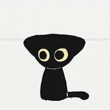

---

### About Me

I like solving problems with data. Curious by nature, drawn to anything at the intersection of data science, data engineering, and ML.

My experience spans data engineering and machine learning, from architecting automated ETL pipelines and Lakehouse architectures to building predictive models for customer acquisition. I focus on solutions that don't just work technically, but reduce manual effort and enable faster, data-driven decisions.

Interested in Sports, Hiking and Motorcycles.

---

### Skills

